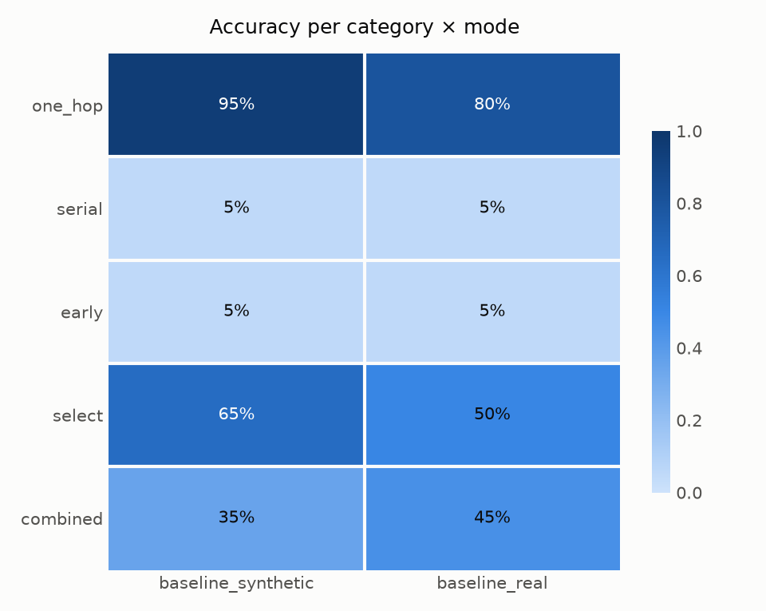

# GEMS-Bench

**German Multi-hop Speech Benchmark** — 100 spoken German questions that a voice
agent can only answer by looking things up.

| | |
|---|---|
| Questions | 100, evenly split over 5 categories |
| Language | German |
| Audio | 200 WAVs — 100 synthesized, 100 human (2 speakers), 24 kHz mono PCM16 |
| Knowledge base | 745 German prose documents over a 426-node graph |
| Tools | BM25 document search + a product-catalog lookup |
| Scoring | deterministic — no LLM judge |
| Closed-book accuracy | 0 by construction |

---

## Why this exists

Voice agents have a structural opportunity that text agents do not: the user
takes several seconds to finish a sentence, and that time can be spent
retrieving. Measuring whether a system actually exploits that turned out to be
hard with existing benchmarks, for two reasons.

**The model already knows the answers.** On benchmarks built from Wikipedia or
other public text, a strong model answers a sizeable share of questions with no
retrieval at all. That puts a ceiling on what any retrieval improvement can
show: if the baseline already scores well from memory, the effect you are trying
to measure is buried under parametric knowledge. Worse, you cannot tell the two
apart from the outside.

**The judge is noisy.** Multi-hop answers are usually graded by an LLM, which
introduces roughly a point of noise per twenty items. When the effect you are
measuring is a few points, the instrument is louder than the signal.

GEMS-Bench removes both by construction rather than by care:

- **Closed world.** Real drugstore products supply the entity skeleton — the
  product names — and nothing else. Every supplier, warehouse, region, buyer,
  team, purchase price, calorie value and stock level is invented and generated
  deterministically from a seed. None of it exists anywhere on the web or in any
  training corpus, so a model with no retrieval scores zero. Not "close to
  zero" — zero, because the answer is an invented token it has never seen.
- **Known gold.** Because the generator invented the answer, the correct answer
  is known rather than judged. Scoring is normalized string matching and numeric
  tolerance. There is no LLM anywhere in the scoring path, so repeated grading
  of the same run gives the same number.

The questions are long and conversational, and they name their entities early,
so there is a real listening window to work in — the median question is 23 words
and the longest is 95. Two of the five categories fan out over 6–10 independent
products, which makes the work parallelizable rather than merely long.

The questions, the tools and the scorer are identical for every system, and the
five categories are weighted equally. `serial` is the contrast case: its steps
depend on each other, so parallelism cannot help there.

---

## What's in it

### The knowledge graph

Products are leaves; everything they connect to is a shared hub, which is what
creates hops in the first place. 300 products over 30 suppliers means suppliers
are genuinely shared — and simultaneously act as distractors.

| Node type | Count | Real or invented |
|---|---|---|
| `produkt` | 300 | name and category real, all attributes invented |
| `marke` | 40 | invented |
| `lieferant` | 30 | invented |
| `lager` | 15 | invented |
| `region` | 8 | invented |
| `einkaeufer` | 30 | invented |
| `team` | 8 | invented |

Edges: `hat_marke` (product→brand), `bezieht_von` (brand→supplier), `liefert`
(product→supplier), `lagert_in` (supplier→warehouse), `liegt_in`
(warehouse→region), `eingekauft_von` (product→buyer), `gehoert_zu` (buyer→team),
`cross_sell` (product↔product, generated but unused — see Limitations).

Hub edges are assigned uniformly at random. No sharing ratio is tuned.

**The override trap.** For half the products the actual `liefert` supplier
differs from the brand's supplier. This stops a deep question from being
short-circuited: an agent that looks up the product's brand and assumes the
brand's supplier gets the wrong answer half the time, so depth-4 chains have to
actually be traversed.

### Question categories

20 items each. Each tests a different capability.

| Category | Shape | Tests |
|---|---|---|
| `one_hop` | entity → attribute | basic retrieval (control) |
| `serial` | A → B → C → D, each step needs the last | dependent multi-step research; parallelism does **not** help |
| `early` | entity named early, question asked late | whether retrieval starts before the sentence ends |
| `select` | 6–10 products named up front → one lookup each → argmax | parallel fan-out |
| `combined` | fan-out plus late aggregation (e.g. a price sum) | fan-out and early retrieval together |

Answers are 80 names and 20 numbers. Gold evidence is 1–10 documents per item.

### Item schema

`manifest.json` is a flat list — this is what you consume:

```json
{
  "id": "one_hop_0000",
  "category": "one_hop",
  "speaker": "speaker_2_male",
  "prompt": "Von welcher Firma wird das Produkt Breischale senfgelb, 1 St geliefert?",
  "spoken": "Weißt du noch, von welcher Firma das Produkt Breischale senfgelb, 1 Stück geliefert wird?",
  "audio_files": {
    "synthetic": "audio_synthetic/one_hop_0000.wav",
    "real": "audio_real/one_hop_0000.wav"
  },
  "audio_durations_s": { "synthetic": 4.783, "real": 8.107 },
  "answer": "Pommern Transport GmbH",
  "accepted_answers": ["Pommern Transport GmbH"],
  "answer_type": "name",
  "number_kind": null,
  "gold_documents": ["doc_0594"]
}
```

`prompt` is the written question; `spoken` is the conversational rewrite that is
actually voiced. `gold_documents` lets you measure retrieval quality separately
from answer accuracy. **Both audio channels are listed on every item** — pick one
at run time, so nothing has to be rebuilt to switch.

### Two audio channels, identical wording

Every question exists as both synthesized and human speech **over the same
words** — the human speakers read `spoken` verbatim, which is the same text the
TTS voices. Any difference in results between the channels is therefore a
property of the voice, not of the phrasing.

|  | Files | Duration |
|---|---|---|
| `audio_synthetic/` | 100 | 34.5 min |
| `audio_real/` | 100 | 43.2 min |

Human speech runs about 25 % longer than TTS at identical wording, which matters
if you are measuring anything time-dependent: the real channel gives an agent
noticeably more listening window.

The 100 human takes are split 50/50 between two speakers, **stratified per
category** — each speaker reads 10 of each category. A global random half would
have loaded one voice onto one category and confounded per-category results with
pace and prosody. The assignment is deterministic from the seed and carried in
the `speaker` field, so you can report results per speaker as a robustness check.

Both channels are listed for every item in `manifest.json`, so choosing one is a
single config setting — no regeneration, and the file on disk never depends on
which channel you happen to be using:

```yaml
audio:
  source: real          # synthetic | real
```

Reading `audio_files[source]` directly is equally fine if your driver prefers
that. Nothing forces you to use only one channel; running both and comparing is
the point of shipping both.

---

## How it was built

The pipeline is 11 stages. Stage 0 is the only one that touches the network;
everything after it is deterministic from `seed`. `main.ipynb` runs them in
order.

| Stage | Module | Does |
|---|---|---|
| 0 | `src/get_products.py` | fetch the product skeleton (the only network call) |
| 1 | `src/clean_products.py` | scrub brands, drop GTIN and price, parse pack sizes |
| 2 | `src/gen_names.py` | invent the hub name pools (LLM, names only) |
| 3 | `src/build_graph.py` | wire the graph, invent every attribute from the seed |
| 4 | `src/emit_corpus.py` | turn each edge into a prose document |
| 5 | `src/gen_questions.py` | walk the graph to produce questions with known gold |
| 6 | `src/spoken_rewrite.py` | rewrite each question as natural spoken German |
| 7 | `src/qa_checks.py` | uniqueness check + closed-book gate |
| 7.5 | `src/validate.py` | text-level defect scan before any audio is made |
| 8 | `src/oss_tts.py` | synthesize audio, ASR-verify every WAV |
| 9 | `src/record_audio.py` | record human speakers, ASR-verify every take |
| 10 | `build_manifest.py` | emit `manifest.json` + provenance |
| 11 | `src/scoring.py` | self-check that gold answers score against themselves |

An LLM is used in exactly three places — inventing name pools, phrasing the
fact sentences, and rewriting questions into spoken German. It never decides a
value or an answer. The graph and all gold answers come from the seeded
generator, which is what makes judge-free scoring possible.

### Four gates, because generated data lies

Each of these caught a class of silent corruption during construction. They run
as part of the pipeline, not as an afterthought.

**Uniqueness (Stage 7).** Exactly one gold answer per item — the generator
verifies no distractor also satisfies the gold path.

**Closed-book gate (Stage 7).** Every question is put to an ensemble of three
large models *without* the corpus. If any of them gets it right, the item is
dropped. This is the empirical proof that nothing leaks parametrically, rather
than an assumption. `select` is exempt and recorded-only: its answer is always
one of the 6–10 product names spoken in the question itself, so a nonzero hit
rate there is a structural property of argmax-over-a-visible-set, not a leak.

**TTS verification (Stage 8).** The TTS checkpoint has two failure modes that
both write a healthy-looking file: it stops after a fraction of the text, and it
occasionally babbles for a plausible duration with unrelated content. A first
run shipped 29 items carrying half their question, concentrated exactly in the
long fan-out categories. Every WAV is therefore transcribed and must recover
60 % of the question's distinctive words, or it is re-sampled; if every attempt
fails, no file is written. Long text is synthesized in segments cut at natural
pause points, because the failure is length-driven.

**Recording gate (Stage 9).** A verbatim read still has to be verified — a
swallowed product name would leave the item underspecified and silently break
the gold. Every take is transcribed and checked for entity recoverability and
gold uniqueness. All 100 takes pass; two carry an audited manual override where
the ASR mangled an English loanword in an otherwise complete read
(`select_0018`, `combined_0019`), recorded in the verdict with its reason.

---

## How to use it

### Install

```bash
python3.12 -m venv .venv
.venv/bin/pip install -r requirements.txt
```

Scoring needs only the core group plus Whisper. The generator and TTS
dependencies are needed exclusively if you want to rebuild the dataset.

Whisper runs via `mlx-whisper` (Apple Silicon, Metal). On other platforms,
substitute an equivalent Whisper build and point `stt.model` in `config.yaml`
at it.

**No credentials are needed to use the benchmark.** Driving the audio into your
system and scoring the result run entirely locally. Credentials are only
required to *regenerate* the dataset, because four stages call an LLM:

```bash
cp .env.example .env.local     # then fill in endpoint + key
```

### The world your agent gets

Two tools, identical for every system, from `gems_tools.py`:

```python
from gems_tools import build_tool_catalog
catalog = build_tool_catalog()
# {name: {"description", "parameters", "handler", "api_delay_ms"}}
```

- **`search_database`** — BM25 keyword search over the German prose corpus, with
  an optional regex pre-filter. Returns up to `retrieval.top_k` documents.
- **`product_lookup`** — structured product master data: brand, supplier, buyer,
  purchase price, kcal, stock level. Scope is **one product per call** and only
  that product's **own direct fields**, so the chain behind a product goes
  through the prose corpus and an aggregation needs one call per product plus
  your own arithmetic.

The handler takes an arguments dict and returns a JSON-serializable dict, so it
drops into any framework.

**Tool latency belongs to the benchmark.** Every call costs
`config.yaml tools.api_delay_ms` (default 300 ms), and the wait sits *inside the
handler*: a real product catalog or PIM service is not instant, and how long a
system waits for facts is part of what is being measured. Because the benchmark
charges it, no contender can pick a friendlier number, and everything that calls
a tool pays — the speech model, a background agent, your own driver. Entries
report the figure as `api_delay_ms` so a run can record what it was measured
with; do not add it a second time in your code. Handlers block while waiting, so
call them off your event loop (`asyncio.to_thread` or a worker thread) —
necessary anyway, since BM25 retrieval is CPU-bound.

### The prompt contract

[`prompts.yaml`](prompts.yaml) holds the German system prompt, both tool
descriptions and the tool response notes. Use them unchanged — that is what
makes two systems comparable. The description strings are model input, so even
respelling them changes tokenisation.

### Run your system

[`example_driver.py`](example_driver.py) does everything except talk to your
agent: it reads the manifest, feeds the question audio at real time, and writes
the answer recording and the run index in the layout the scorer expects.
Subclass its `VoiceSystem` and implement three methods — `start_turn(item)`,
`send_audio(chunk)`, `end_turn()` — then hand an instance to `run()`.

Run it unmodified first to check the plumbing — the built-in `SilentSystem`
answers nothing, so every item scores incorrect, but audio, records, index and
scoring are all exercised without a model, credentials or cost:

```bash
python example_driver.py --mode smoke_test --questions one_hop_0000,serial_0001
python judge.py
```

**Audio is fed at real time on purpose.** An agent handed the whole utterance at
once has no listening window to work in, which is half of what this benchmark
measures. `example_driver.py` paces the stream for you; don't optimize that away.
Pacing knobs live under `realtime:` in `config.yaml`.

### The contract the scorer expects

`judge.py` does not care how the answer was produced. It needs two things:

**1.** A run index at `results/benchmark_run.json`:

```json
{ "<your_mode>": { "<question_id>": {
    "session_id": "...", "run_id": "...",
    "mode": "<your_mode>", "status": "ok"
} } }
```

`status` must be `"ok"` to be graded, and `question_id` must match a
`manifest.json` id.

**2.** Per-session records under `paths.runner_output_dir`, at
`<run_id>/records/<session_id>/`:

- `assistant_audio.wav` — the spoken answer, 24 kHz mono PCM16. **This is what
  gets graded**, transcribed offline with Whisper.
- `transcript.jsonl`, `timing.jsonl` — optional; feed the latency and
  tool-split metrics if present.

### Score it

```bash
python judge.py       # deterministic grading -> results/results.json
python analyze.py     # aggregate metrics + plots -> results/plots/
```

Grading is normalized matching against known gold: names are lowercased,
punctuation-stripped, umlaut-folded and fuzzy-matched to tolerate ASR error on
invented words; numbers must fall inside a per-kind tolerance (stock levels
exact, prices to the cent); lists must match as a set. No LLM is involved, so
the number is stable.

`results/` is created on first use and holds your own output; it is not
committed. Measured runs live in [`baselines/`](baselines/), produced with
[`driver/azure_realtime.py`](driver/azure_realtime.py) so they can be
reproduced. Treat them as reference points, not targets: a score depends on the
model, the architecture around it and the hardware, so one system's number is
not a target for another.

---

## Does TTS distort the results?

The benchmark ships every question twice, synthesized and human-read, over the
same words. That exists to answer one question: can you trust a number measured
on synthetic speech? We ran plain Azure OpenAI Realtime (`gpt-realtime-1.5`,
server VAD, no orchestration) over all 100 questions on both channels.



**41/100 synthesized, 37/100 human-read** — and that gap is not real. The same
100 questions run on both channels, so the comparison is paired: 29 items were
answered correctly on both, 51 failed on both, and only 20 split, 12 in favour of
synthetic and 8 in favour of human speech. Exact McNemar gives p = 0.50. Latency
agrees even more closely — median TTFA 4.33 s against 4.34 s, a paired median
difference of +0.04 s, which is what a baseline that does nothing while listening
should show and confirms the two runs were measured under the same conditions.

So synthesized audio is a fair stand-in, and a result measured on it does not
need a human-recorded twin to be believed.

Two things the human channel does change.

**Server VAD splits far more turns.** A pause long enough to look like the end of
a sentence ends the turn, and human speech has more of them: the turn was split
on 29 of 100 human recordings against 1 of 100 synthesized. A driver that treats
the first response as the answer will score those items on half a question —
`driver/azure_realtime.py` discards an answer that arrives while question audio
is still being fed and waits for the one after the real end.

**Human speech is ~25 % longer at identical wording**, so a system that works
during the listening window gets more room on this channel. If that is what your
architecture does, measure it on both: the synthesized channel is the more
conservative number.

The per-speaker split is *not* evidence of a voice effect, though `analyze.py`
prints it under that heading. The two speakers differ by 10 points on the human
channel (32 % vs 42 %, Fisher p = 0.41) — but the same two halves of the question
set differ by 10 points on the synthesized channel too (36 % vs 46 %, p = 0.42),
where a single TTS voice reads everything. That is difficulty variation between
two halves of 50 items, and it is a useful reminder of how much a 10-point
difference on this benchmark can be worth: nothing.

---

## What is and is not reproducible

- **The committed artifacts in `data/` are the dataset.** The generator is here
  so you can audit how they were made and build variants.
- **Regeneration is not bit-identical.** The three LLM stages run at temperature
  0, but through a hosted endpoint, so exact reproduction is not guaranteed. The
  graph, the gold answers and every numeric attribute *are* bit-reproducible
  from `seed` — only the phrasing can drift.
- **Stage 0 cannot reproduce its original fetch.** It reads a live product
  catalog that changes over time. `data/raw/` holds the responses the shipped
  dataset was built from, so the scrubbing step can be re-checked; a fresh fetch
  will return a different product set.
- **Running the generator needs your own LLM endpoint** (`AZURE_ENDPOINT` /
  `AZURE_API_KEY`, or edit `llm:` in `config.yaml`), plus a local TTS model for
  Stage 8. Scoring an existing run needs neither.

Every behavioural knob lives in `config.yaml`. There are no tunable constants
hidden in the Python.

---

## Limitations

- **`cross_sell` edges are generated but unused.** No question or document
  consumes them. The knob has no observable effect today; it is reserved for a
  future related-product family.
- **`select` is exempt from the closed-book gate.** Its answer is one of the
  product names already spoken in the question, so the gate records hits for
  diagnostics but does not drop items. This is a property of argmax-over-a-
  visible-set, and it means `select` is the one category where guessing beats
  zero — with 6–10 options, at roughly 1 in 8.
- **`product_lookup` has no minimum-match threshold.** If an agent asks for a
  product that is not in the catalog, the tool can return an unrelated product
  with `status: success` rather than reporting no match, because a shared size
  token (`ml`, `g`, `St`) is enough to match.
- **Only 100 items.** Fine for large per-category effects; underpowered for
  small ones. Categories are 20 items each, so a per-category accuracy moves in
  5-point steps.
- **One retrieval backend.** BM25 with optional regex. No embedding backend, so
  the benchmark makes no claim about lexical versus semantic retrieval on
  invented names.
- **Two speakers, both German-native.** No accent, age or recording-condition
  variation. The human channel tests whether TTS distorts results; it is not a
  speaker-robustness benchmark.
- **The end-of-speech deadline is a proxy, not a wall-clock constraint.**
  `gold_doc_recall_eos` reports how much of the needed evidence a system had
  when the user stopped speaking. It is count-based rather than timed, so
  results do not depend on how fast your hardware is.

---

## License and attribution

Apache License 2.0 — see [`LICENSE`](LICENSE) and [`NOTICE`](NOTICE).

Product names are real dm-drogerie markt products from the publicly accessible
product search on dm.de; no trademark rights are granted. Everything else in the
dataset is invented.

Thanks to the projects this is built on — see
[`ACKNOWLEDGEMENTS.md`](ACKNOWLEDGEMENTS.md).
